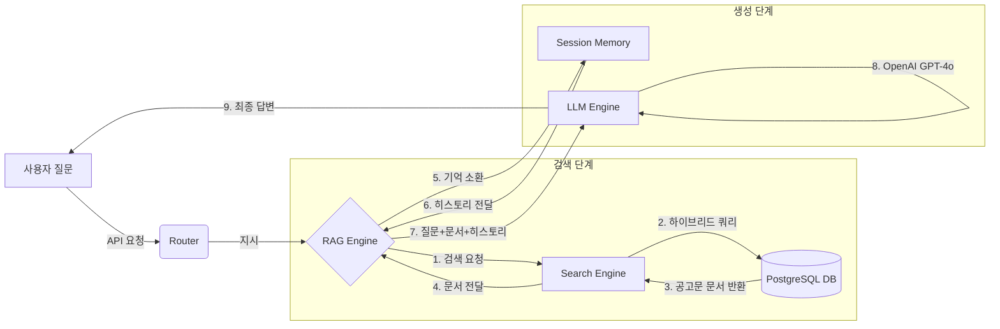

이인재 작업 공간

상위 작업폴더에서 진행시 수정해야 되는 파일
main.py
from . import router 
from .rag import RAGEngine
from .dependencies import set_rag_engine

router.py
from .models import ChatRequest, ChatResponse
from .dependencies import get_rag_engine
from .rag import RAGEngine

rag.py
from .search import SearchEngine
from .llm_engine import LLMEngine
from . import session

search.py
from .config import EMBEDDING_MODEL, DEFAULT_TOP_K, SIMILARITY_THRESHOLD
from .database import DatabaseManager

llm_engine.py
from .config import OPENAI_API_KEY, OPENAI_MODEL, OPENAI_TEMPERATURE, OPENAI_MAX_TOKENS
from .prompts import SYSTEM_PROMPT, USER_PROMPT_TEMPLATE

dependencies.py
from .rag import RAGEngine

database.py
from .config import DB_CONFIG

-----

### 1\. 핵심 기능 (Core Features)

#### ⓵ 지능형 하이브리드 검색 (Smart Hybrid Search)

사용자의 질문 의도를 파악하여 가장 정확한 문서를 찾아냅니다.

  * **의미 기반 검색 (Vector Search):** "신혼부부가 살만한 곳"처럼 단어가 일치하지 않아도 의미가 통하는 공고를 찾습니다. (BGE-M3 임베딩 사용)
  * **키워드 정밀 검색 (Keyword Search):** "국민임대", "5000만원" 같은 특정 단어가 포함된 문서를 정확히 찾습니다.
  * **자동 필터링 (Auto Filtering):** 질문에 **"남양주"**, **"분양"** 같은 단어가 있으면, 코드가 이를 감지하여 DB 검색 범위를 자동으로 좁힙니다. (`search.py`)

#### ⓶ 문맥 인식 연속 대화 (Multi-turn Conversation)

단발성 질문으로 끝나지 않고, 사람과 대화하듯 꼬리에 꼬리를 무는 질문이 가능합니다.

  * **대화 기억 (Session Memory):** `session.py`가 사용자의 이전 질문과 AI의 답변을 기억합니다.
  * **상호참조 해결:**
      * Q1: "남양주에 공고 있어?" -\> A: "네, 진접지구가 있습니다."
      * Q2: "**거기** 보증금은 얼마야?" -\> \*\*"거기"\*\*가 "남양주 진접지구"임을 알아듣고 답변합니다.

#### ⓷ 할루시네이션(거짓 답변) 방지

AI가 없는 말을 지어내지 않도록 강력한 제어 장치를 두었습니다.

  * **Grounding:** 철저하게 **DB에서 검색된 공고문(Context)** 내용만을 근거로 답변합니다.
  * **전문가 프롬프트:** "정보가 없으면 없다고 말하라"는 지침이 `prompts.py`에 명시되어 있어 신뢰할 수 있습니다.

-----

### 2\. 데이터 처리 흐름 (Workflow)

사용자가 질문을 던졌을 때 내부에서 일어나는 일입니다.

